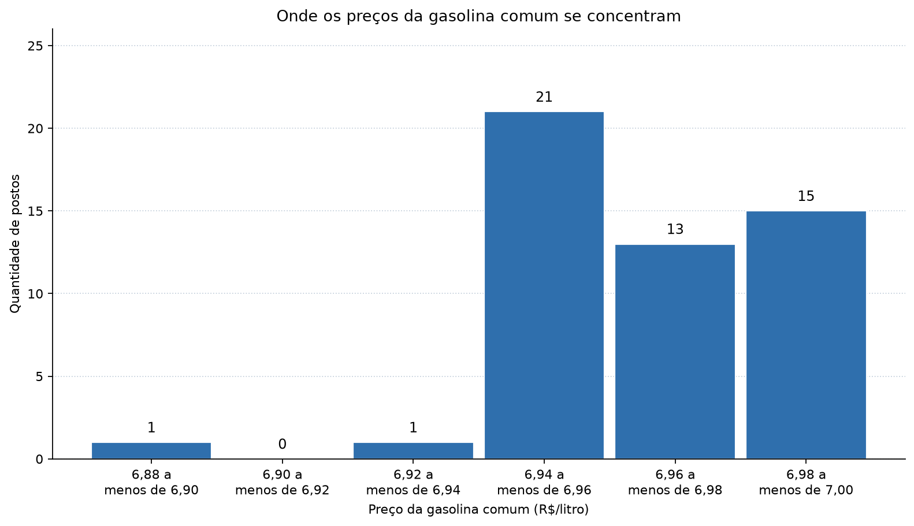
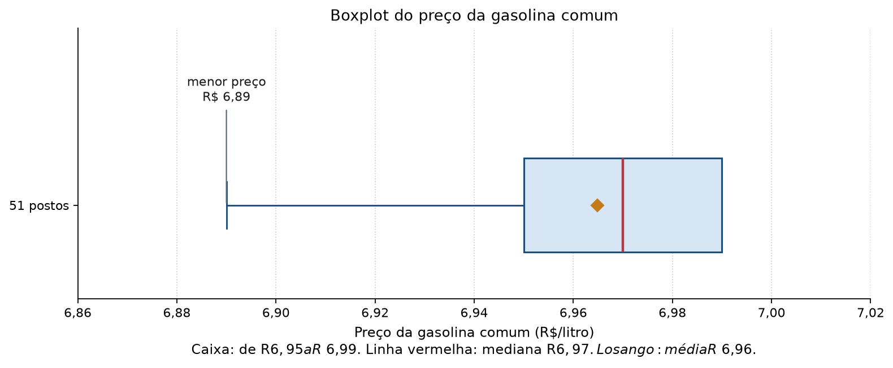

# Ficha: qual é o preço típico da gasolina comum

**Aluna:** Thayná Batista da Silva
**Curso:** Tecnólogo em Análise e Desenvolvimento de Sistemas
**Faculdade:** Senac Pernambuco, Recife-PE
**Unidade curricular:** Data Science: Princípios e Técnicas, 2026.2
**Turma:** TADS25.109/3N
**Professor:** Rodrigo Rios
**Data desta ficha:** 09/10/2026

Usei apoio de IA para organizar as contas. Depois conferi cada medida na planilha `conferencia_calculos.xlsx`. Os preços originais não foram alterados.

## Pergunta

Qual é o preço típico da gasolina comum nos postos pesquisados?

## Recorte dos dados

A base é o levantamento de preços da ANP. Cada linha é uma coleta de preço em um posto.

- Produto: gasolina comum. Gasolina aditivada e etanol ficaram de fora.
- Lugares: Recife, Olinda e Jaboatão dos Guararapes.
- Semana do recorte: 21 a 27/09/2026.
- As coletas que existem na base ocorreram em 21, 23 e 24/09/2026.
- Unidade do preço: reais por litro, pago pelo consumidor no dia da coleta.
- Quantidade: 51 postos, com 51 CNPJs diferentes.

Fonte: Agência Nacional do Petróleo, Gás Natural e Biocombustíveis. Série histórica de preços de combustíveis e de GLP. Dados de setembro de 2026. Consulta em 08/10/2026.
https://www.gov.br/anp/pt-br/centrais-de-conteudo/dados-abertos/serie-historica-de-precos-de-combustiveis

## Conferência da base

| Conferência | O que encontrei |
| --- | --- |
| Registros | 51 linhas e 51 CNPJs. Nenhum CNPJ repetido. |
| Preços vazios | Nenhum. Todos os 51 preços entraram na conta. |
| Produto | Só GASOLINA. |
| Cidades | Recife: 28 postos. Jaboatão dos Guararapes: 13. Olinda: 10. |
| Datas | 21/09/2026: 35 postos. 23/09/2026: 13 postos. 24/09/2026: 3 postos. |
| Tratamento | Nenhum preço foi removido, arredondado na base ou completado. |

A soma dos 51 preços é R$ 355,21. Essa soma é a base da média.

## Resultados

As contas usam os 51 preços. O desvio padrão é amostral: a soma dos desvios ao quadrado foi dividida por 50, porque 51 menos 1 é 50. Na apresentação, a média e o desvio padrão ficam com 4 casas decimais. Os outros valores já caem em centavos.

| Medida | Resultado | Leitura simples |
| --- | --- | --- |
| Média | R$ 6,9649 por litro | 355,21 dividido por 51. |
| Mediana | R$ 6,97 por litro | O 26º preço, com a lista em ordem. |
| Moda | R$ 6,95 por litro | Aparece 21 vezes. |
| Amplitude | R$ 0,10 por litro | Vai de R$ 6,89 até R$ 6,99. |
| Desvio padrão amostral | R$ 0,0202 por litro | Os preços variam pouco em torno da média, cerca de 2 centavos. |

### Mediana, passo a passo

Ordenei os 51 preços do menor para o maior. Como 51 é ímpar, a mediana é o valor da posição 26. Esse valor é R$ 6,97.

### Moda

| Preço (R$/litro) | Postos | Percentual |
| --- | --- | --- |
| 6,89 | 1 | 1,96% |
| 6,93 | 1 | 1,96% |
| 6,95 | 21 | 41,18% |
| 6,97 | 13 | 25,49% |
| 6,98 | 2 | 3,92% |
| 6,99 | 13 | 25,49% |
| Total | 51 | 100% |

O preço de R$ 6,95 é a moda porque é o que mais se repete. São 21 postos, ou 41,18% do conjunto. Não é a maioria: 30 postos cobraram outro preço.

Em Olinda, os 10 postos pesquisados cobraram R$ 6,95. Isso aumenta a moda. A conclusão abaixo vale para as três cidades juntas.

### Quartis usados no boxplot

O método é o da aula. Com quantidade ímpar, a mediana geral sai da lista. Cada metade tem 25 preços. Q1 é a mediana da metade de baixo. Q3 é a mediana da metade de cima.

- Q1, posição 13 da lista ordenada: R$ 6,95
- Mediana, posição 26: R$ 6,97
- Q3, posição 39 da lista ordenada: R$ 6,99
- Intervalo interquartil: 6,99 menos 6,95 = R$ 0,04

Outro método de quartil pode dar outro número. Deixei o método escrito para a conta poder ser repetida.

Limites do boxplot, pelo critério de 1,5 vezes o intervalo interquartil:

- 1,5 vezes R$ 0,04 = R$ 0,06
- Limite de baixo: 6,95 menos 0,06 = R$ 6,89
- Limite de cima: 6,99 mais 0,06 = R$ 7,05

O menor preço é R$ 6,89. Ele fica em cima do limite de baixo, então continua dentro do conjunto. Nenhum preço passa de R$ 7,05. Por esse critério, não há valor atípico. Nenhum posto foi retirado da análise.

O critério só avisa quando um número está longe do centro. Ele não prova erro de coleta. Fonte do critério: NIST/SEMATECH e-Handbook of Statistical Methods.
https://www.itl.nist.gov/div898/handbook/

## Gráficos

### Histograma

As faixas têm a mesma largura, de R$ 0,02. Cada faixa inclui o começo e deixa o fim de fora. Exemplo: a faixa "6,94 a menos de 6,96" inclui 6,94 e não inclui 6,96.

Como ler as barras:

- 6,88 a menos de 6,90: 1 posto, o preço de R$ 6,89.
- 6,90 a menos de 6,92: nenhum posto.
- 6,92 a menos de 6,94: 1 posto, o preço de R$ 6,93.
- 6,94 a menos de 6,96: 21 postos, todos a R$ 6,95.
- 6,96 a menos de 6,98: 13 postos, todos a R$ 6,97.
- 6,98 a menos de 7,00: 15 postos, sendo 2 a R$ 6,98 e 13 a R$ 6,99.

A maior barra é a de R$ 6,95. Os preços se juntam entre R$ 6,95 e R$ 6,99. São 49 dos 51 postos.

### Boxplot

O boxplot usa os quartis calculados acima. O eixo começa em R$ 6,86 e termina em R$ 7,02 para os centavos aparecerem. Todos os preços estão entre R$ 6,89 e R$ 6,99.

Como ler o desenho:

- A caixa vai de R$ 6,95 a R$ 6,99.
- A linha vermelha é a mediana, R$ 6,97. Ela fica no meio da caixa.
- O losango é a média, R$ 6,96. Ele fica logo à esquerda da mediana, ainda dentro da caixa.
- O bigode de baixo chega a R$ 6,89.
- O bigode de cima termina em R$ 6,99, no próprio fim da caixa, porque o maior preço também é R$ 6,99.
- Não há ponto fora dos bigodes.

## Conclusão

A medida que melhor representa o preço típico deste conjunto é a **mediana, R$ 6,97 por litro**.

Ela é o centro da lista ordenada. O preço típico que eu adoto para estes 51 postos é R$ 6,97.

A média deu R$ 6,9649. Ela fica perto da mediana. Mesmo assim, uso a mediana para responder a pergunta. A média reparte a soma entre os postos, e os preços de R$ 6,89 e R$ 6,93 puxam essa conta um pouco para baixo. Nenhum posto cobrou exatamente R$ 6,9649.

A moda é R$ 6,95. Ela responde outra pergunta: qual preço apareceu mais vezes. Foram 21 postos. Outros 13 cobraram R$ 6,97 e outros 13 cobraram R$ 6,99. Por isso a moda, sozinha, não resume o centro do conjunto.

As três medidas cabem em uma faixa de cerca de 2 centavos. O desvio padrão amostral de R$ 0,0202 e a amplitude de R$ 0,10 mostram que, nesta semana e nestes postos, o preço da gasolina comum variou pouco.

## Limitação dos dados

Cada posto entra na conta com o mesmo peso. A base não diz quantos litros cada posto vendeu. Um posto com pouco movimento conta igual a um posto com muito movimento. O preço típico desta ficha é o preço do meio entre os postos pesquisados. Ele não é o preço típico pago por litro pelos motoristas.

O recorte também tem limite de cobertura. São 51 postos que a ANP pesquisou em três cidades, em alguns dias da semana de 21 a 27/09/2026. A base não inclui todos os postos dessas cidades, não mostra o preço de hoje e não explica a causa da diferença entre um posto e outro.

## Onde conferi as contas

Planilha: `conferencia_calculos.xlsx`.

Na aba Medidas, as fórmulas do LibreOffice ou do Excel devem mostrar:

- quantidade 51
- soma 355,21
- média 6,9649
- mediana 6,97
- moda 6,95
- amplitude 0,10
- desvio padrão amostral 0,0202
- Q1 6,95 e Q3 6,99

A aba Lista_ordenada marca as posições 13, 26 e 39. A aba Frequencia refaz a contagem de cada preço.

## Fontes

AGÊNCIA NACIONAL DO PETRÓLEO, GÁS NATURAL E BIOCOMBUSTÍVEIS. Série histórica de preços de combustíveis e de GLP. Dados de setembro de 2026. Brasília, DF: ANP, 2026. Acesso em: 8 out. 2026. Disponível em: https://www.gov.br/anp/pt-br/centrais-de-conteudo/dados-abertos/serie-historica-de-precos-de-combustiveis

NATIONAL INSTITUTE OF STANDARDS AND TECHNOLOGY; SEMATECH. NIST/SEMATECH e-Handbook of Statistical Methods. Disponível em: https://www.itl.nist.gov/div898/handbook/. Acesso em: 3 out. 2026.

RIOS, Rodrigo. Estatística descritiva: o que os números revelam e o que não permitem concluir. Recife: Centro Universitário Senac Pernambuco, 2026. Material de aula da unidade Data Science: Princípios e Técnicas.

O guia que acompanha o arquivo da atividade pede desvio padrão amostral, com divisor n - 1, e o método de quartis da aula. Segui essas duas regras.
